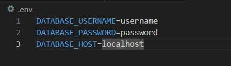
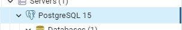

# Rails Getting Started Blog

## Table of Contents
- [Introduction](#introduction)
- [Technologies](#technologies)
- [Database Config](#database-config)
- [Containers Construction](#containers-construction)
- [Server execution](#server-execution)
- [Debug your Application](#debug-your-application)
- [Documentation](#documentation)

## Introduction

This project uses [Getting Started with Rails](https://guides.rubyonrails.org/getting_started.html) as a base project for study, and it extends to whatever else comes to mind for practice and web development using Ruby on Rails.

## Technologies
This project uses:
 - [Rails v7.1.2](https://rubyonrails.org/)
 - [Ruby v3.2.1](https://www.ruby-lang.org/en/)
 - [Bundler v2.4.9](https://bundler.io/)
 - [Docker](https://docs.docker.com/compose/install/)
 - [PostgreSQL](https://www.postgresql.org/docs/current/installation.html)

### Database Config

Create the .env file and modify the variables according to your context.



You can find your "Host name/address" and "Username" inside your pgAdmin under the "Connection" tab.




### Containers Construction

* Build the images:

```console
docker-compose build
```

* Create your database:

```console
docker-compose run web rails db:create db:migrate
```

* Start the containers:

```console
docker-compose up -d
```

* Enter the container that contains the Rails application:

```console
docker-compose exec web bash
```

* --------------- Only in the first time, do it ---------------

* Inside the bash, run:
```console
./bin/dev
```

* Finish the containers:
```console
docker-compose down
```

* Start again the containers with:
```console
docker-compose up
```

or

```console
docker-compose up -d
```

### Server execution

* Start Sidekiq to run background jobs:

```console
sidekiq
```

## Debug your Application
* With the containers up, open another terminal and attach it to the web container using the following command:
 ```console
docker attach container_id
```

* You can find your container ID using the following command:
 ```console
docker container ls
```

## Documentation

Coming soon...
